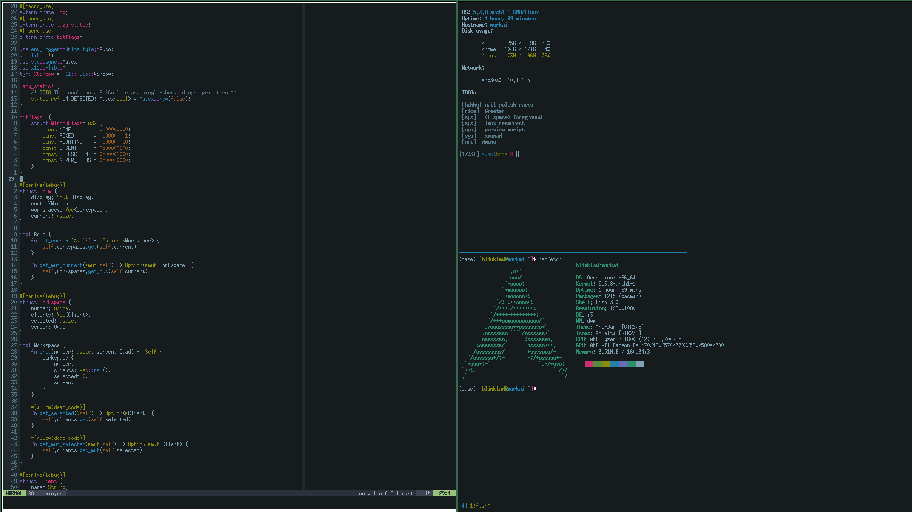

# rdwm

## DWM-inspired window manager for X

## Goals
Happy hacking. I would love to make a minimalistic, dwm-inspired yet idiomatic clone that could be used as a basis for other Rust WM projects.
Ideally this project would use XCB, as well.

## Running
The provided [build script](run.sh) should work, as long as you have:
1. Xephyr
2. Xterm (or another simple X program, eg. Xeyes)

## Timeline

| Feature / Goal                                                                      | State              | Notes                                                                                                    |
| -------                                                                             | -----              | -----                                                                                                    |
| Basic tiling                                                                        | Adding grid logic  |                                                                                                          |
| Unit tests & mocking                                                                | N/A                | Static assertions are used heavily for FFI safety                                                        |
| Workspaces                                                                          | Currently singular |                                                                                                          |
| Fullscreen selection                                                                | N/A                |                                                                                                          |
| Floating mode                                                                       | N/A                |                                                                                                          |
| Gaps                                                                                | N/A                |                                                                                                          |
| XCB                                                                                 | N/A                | Currently using XLib; Core abstractions are designed such that they are agnostic of underlying bindings |
| 'Swallows' DWM-like feature                                                         | N/A                |                                                                                                          |
| Sane fonts                                                                          | N/A                |                                                                                                          |
| Respect graphics toolkit clients (GTK, QT)                                          | N/A                |                                                                                                          |
| Stateful (de-)serialization of children tree for opinionated yet _easy_ restoration | N/A                | i3-gaps exposes granular configuration; rdwm will make decisions for users as to abstract complexity     |
| User configuration for border rules                                                 | N/A                |                                                                                                          |
